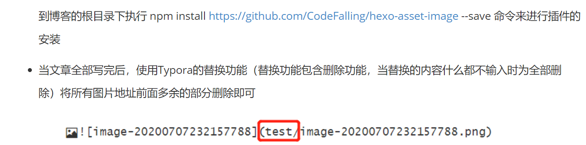
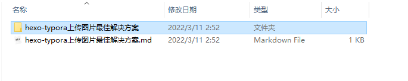
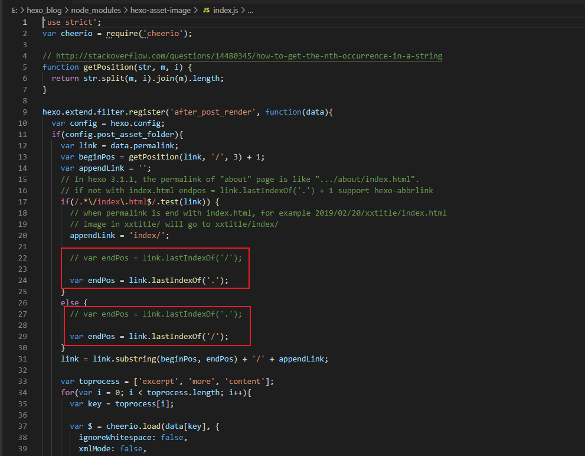
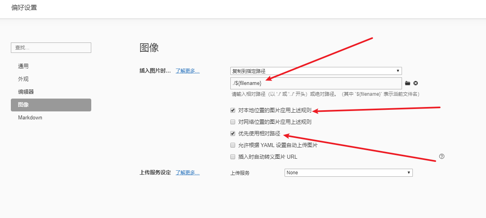

hexo-typora上传图片最佳解决方案,无需图床

<!-- more -->

## 问题引入

hexo + Typora图片上传不显示的问题；**此方法解决了，本地和远端图片路径不一致问题，导致无法两端无法兼容**


**传统方案：**

导致本地文档图片引用失效




##  解决方案


**一：**如下修改 Hexo 博客目录中的 `_config.yml`，打开这个配置是为了在生成文章的时候生成一个同名的资源目录用于存放图片文件。

1. DSS

```yaml
# 打开这个配置是为了在生成文章的时候生成一个同名的资源目录用于存放图片文件
post_asset_folder: true
```




 **二：**安装hexo-asset-image


```shell
npm install hexo-asset-image --save
```


**三：**修改该插件目录下的index.js文件





**四：**修改typora的图片存储路径




