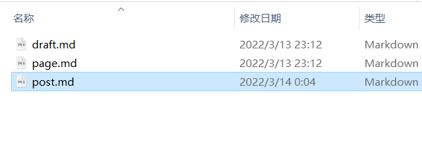

使用hexo n "文章名称"新建文章时候默认模版为

```SHELL
title: {{ title }}
date: {{ date }}
tags:
```

此时，默认模版是不包含**分类**标签的，我们可以手动修改模版文件。

模版文件地址为caffolds/post.md；

只需要修改模版添加categories:就能达到创建新文章时包含分类属性




```shell
title: {{ title }}
date: {{ date }}
tags:
categories:
```


