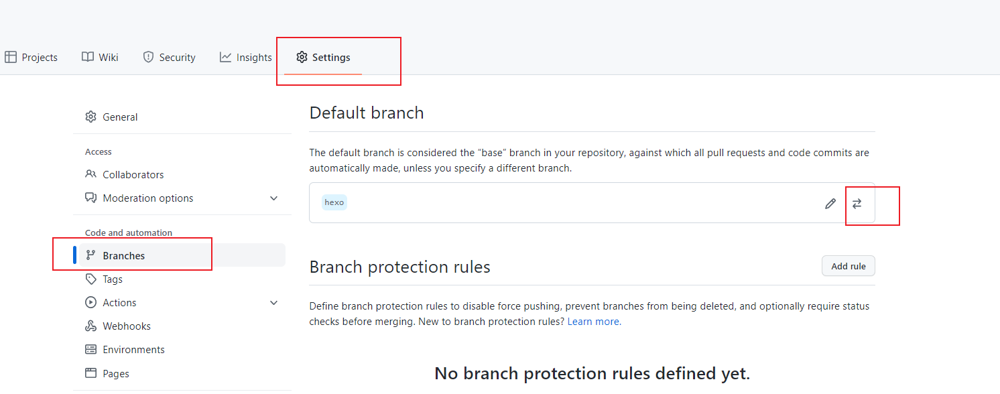
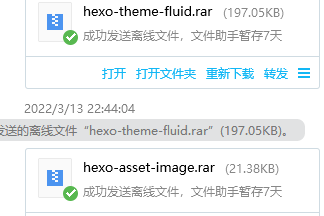

# Hexo多终端操作


一、先 github上新建一个hexo分支，如新建hexo分支，把此分支设置为默认分支（这样每次同步的时候就不用指定分支，比较方便）。




二、在本地的任意目录下，打开git bash，将其克隆到本地，因为默认分支已经设成了hexo，所以clone时只clone了hexo；，把除了.git 文件夹外的所有文件都删掉，把之前我们写的博客源文件全部复制过来，除了`.deploy_git`，复制过来的源文件应该有一个`.gitignore`，用来忽略一些不需要的文件，如果没有的话，自己新建一个，如下

```java
.DS_Store
Thumbs.db
db.json
*.log
node_modules/
public/
.deploy*/
_multiconfig.yml
```


三、上传当前分支的修改


```java

git add .
git commit –m "hexo 分支初始化"
git push
```


四、新的终端操作,确保新的终端已经安装了node，npm

- 安装hexo

  ```shel
  sudo npm install hexo-cli -g
  
  ```

  

- clone 下来hexo分支
- 进入到clone的文件夹,安装依赖

```bash

cd xxx.github.io
npm install
```


五、特殊配置（第三步时候，由于我修改了node_modules中的文件，所以需要把主题插件和image插件copy过来，如果未修改，可以忽略此步骤），替换安装的局部依赖中的文件




六、生成、查看、部署

```bash
# 生成文件
hexo g
# 本地预览
hexo s
# 部署
hexo d
```


**Tips：**

1. 不要忘了，每次写完最好都把源文件上传一下，因为hexo d 部署的master 分支， 我们写作的文件在hexo分支，所以修改新增文章后需要把最新的文件上传到远端分支
2. 换电脑操作时候，记得 首先把远端的文件pull下来，再操作，因为部署到githubpage 的文件是在本地生成的


