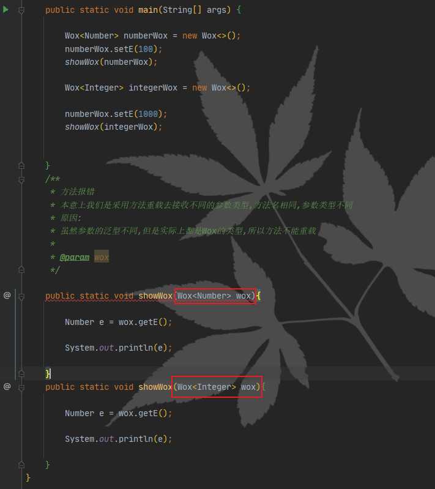
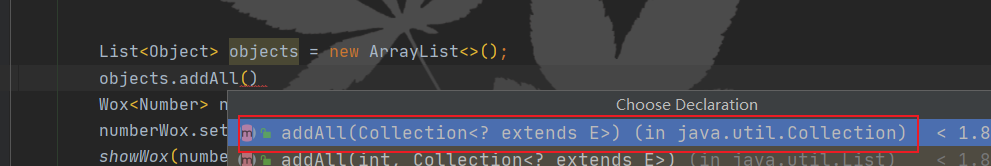
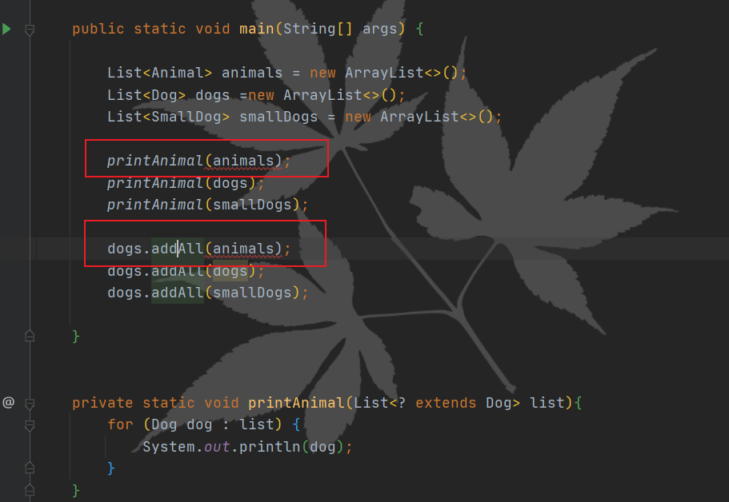
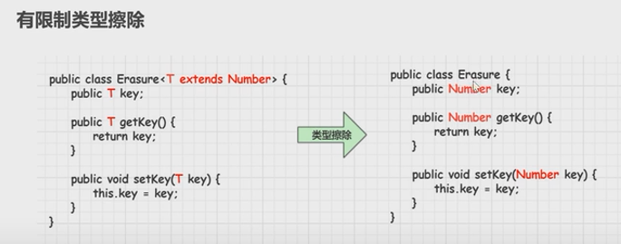
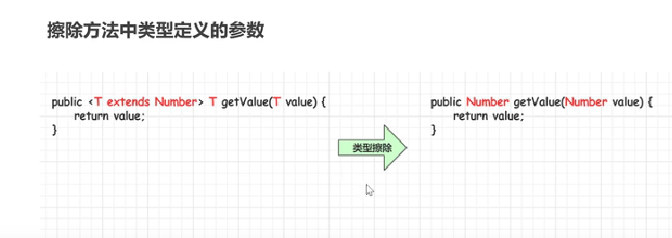
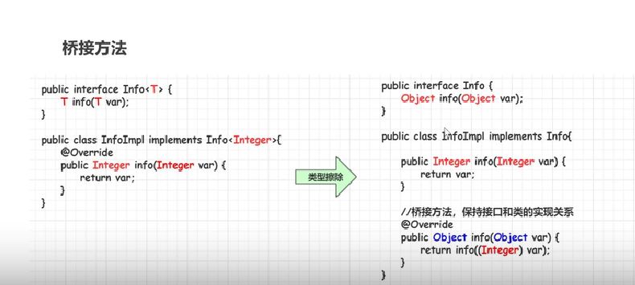

<p class="note note-info">泛型程序设计分为三个能力水平，基本水平是仅仅使用泛型           --《Java核心技术卷Ⅰ》</p>

<!-- more -->


## 什么是泛型

Java 5 中引入了泛型这个重要的概念,提供了编译时类型安全监测机制,泛型的本质就是**参数化类型**,也就是说所操作的数据类型被指定为一个参数。

**早期Java是使用Object来代表任意类型的，但是向下转型有强转的问题,例如集合操作**

**Java泛型设计原则：**只要在编译时期没有出现警告，那么运行时期就不会出现**ClassCastException(类型转换异常)**异常

**泛型：**把类型明确的工作推迟到创建对象或调用方法的时候才去明确的特殊的类型

**优势:**

- 类型安全
- 消除了强制类型的转换


## 泛型类


### 泛型类

**语法：**

```java
class 类名称<泛型标识，泛型标识，...>{
    
    private 泛型标识  变量名;
    
    ...
        
    ...
}


// 使用语法

类名<具体数据类型> 对象名  = new 类名<具体数据类型>（）；
    
jdk1.7以后，类型推断
类名<具体数据类型> 对象名  = new 类名<>（）；
 
    
// 1.泛型类使用的时候没有指定具体的数据类型的时候，将按照Object类型来接受的
// 2.泛型类不允许指定  基本数据类型    
```


**常用的泛型标识符:**

```java
T、E、K、V
```


### 泛型类定义

T,是由外部使用的时候所指定的

```java
public class GenericClazz<T> {

    private Integer number;

    private T t;

    public Integer getNumber() {
        return number;
    }

    public void setNumber(Integer number) {
        this.number = number;
    }

    public T getT() {
        return t;
    }

    public void setT(T t) {
        this.t = t;
    }

    @Override
    public String toString() {
        return "GenericClazz{" +
                "number=" + number +
                ", t=" + t +
                '}';
    }

    public static void main(String[] args) {

        GenericClazz<String> genericClazz = new GenericClazz<>();
        // 确定的数据类型
        genericClazz.setNumber(10);
        genericClazz.setT("外部使用的时候传入的类型");
        System.out.println(genericClazz);


        GenericClazz<String> clazz2 = new GenericClazz<>(100, "构造方法");

        // 未指定具体的类型，将按照Object来进行推断
        GenericClazz<Object> clazz3 = new GenericClazz<>();
        
    }
}
```


**注释：**

1. 常见的做法是类型变量使用大写字母，而且很简短。Java库使用变量E表示集合的元素类型，K和V分别表示表的键和值的类型。T表示任意类型（必要时和可以使用相邻的字母U和S)表示任意类型；
2. 泛型类使用的时候没有指定具体的数据类型的时候，将按照Object类型来接受的；
3. 泛型类使用时不允许指定  **基本数据类型**   。
4. 泛型类逻辑上可以看成的不同的类型，实际上都是相同类型，可以通过指定不同的数据类型进行内存地址的比较，发现指向是同一个内存地址

### 泛型类实战

构建商品抽奖器

```java
public class ProductGetter<T> {
    private final Random random = new Random();
    private final List<T> productList = new ArrayList<>();

    public void addProduct(T t){
        productList.add(t);
    }
    
    // 普通成员方法,在泛型类中不能被声明为静态的 
    public T getRandomProduct(){

        return productList.get(random.nextInt(productList.size()));
    }
    public static void main(String[] args) {

        ProductGetter<String> productPool = new ProductGetter<>();

        String[] products = new String[]{"mac电脑","苹果手机iphone","华为phone",};

        for (String product : products) {

            productPool.addProduct(product);
        }
        String randomProduct = productPool.getRandomProduct();

        System.out.println(randomProduct);
        
    }
}
```


### 泛型类派生子类

- **如果子类也是泛型类，子类和父类的泛型要一致**

```java
// 如果子类是泛型类,父类没有明确泛型类,则重写父类方法的时候返回的是Object()类型
public class ChildGenericClazz<T> extends ParentGenericClazz{

    @Override
    public Object getStr1() {
        return super.getStr1();
    }
}

// 正确使用
public class ChildGenericClazz<T> extends ParentGenericClazz<T>{

    @Override
    public T getStr1() {
        return super.getStr1();
    }
}

```


- **子类不是泛型类，父类要明确具体的泛型的类型**


```java

// 子类和父类都不明确泛型类,则会导致子类和父类都会被当成普通类来出来
public class ChildGenericSecondClazz extends ChildGenericClazz {
   // 此处返回的是Object
    @Override
    public Object getStr2() {
        return super.getStr2();
    }
}


// 父类不明确具体的泛型类型的话会报错
public class ChildGenericSecondClazz extends ChildGenericClazz<String> {

    @Override
    public String getStr2() {
        return super.getStr2();
    }
}

```


## 泛型接口


### **语法定义**

```java

interface 接口名称<泛型标识,泛型标识>{
    
    泛型标识 方法名();
    
}
```


### 接口使用

- 实现类不是泛型类,接口要明确数据类型
- 实现类也是泛型类,实现类和接口的泛型类型要一致

```java
public class IGenericInterfaceImpl implements GenericInterface {

    // 未指定泛型接口,则实现类返回的是object
    @Override
    public Object getKey() {
        return null;
    }

}

// 正解:
public class IGenericInterfaceImpl implements GenericInterface<String> {

    @Override
    public String getKey() {
        return null;
    }
}

// 泛型扩充
public class IGenericInterfaceImpl<T,E> implements GenericInterface<T> {

    private T key;
    private E value;


    public IGenericInterfaceImpl(T key, E value) {
        this.key = key;
        this.value = value;
    }

    private E getValue(){

        return value;
    }

    @Override
    public T getKey() {
        return null;
    }

    @Override
    public String toString() {
        return "IGenericInterfaceImpl{" +
                "key=" + key +
                ", value=" + value +
                '}';
    }

    public static void main(String[] args) {

        IGenericInterfaceImpl<String, Integer> key = new IGenericInterfaceImpl<>("key", 100);

        System.out.println(key);

    }
}


```


## 泛型方法


**泛型方法: **调用方法的时候指明泛型的具体类型


泛型方法可以在普通类中定义,也可以在泛型类中定义


### 语法

```java
修饰符 <T,E,K,V,U,S...> 返回值类型 方法名(str1,str2,...){
    
    方法体(){}
}
```

- 只有声明了<T> 的方法才是泛型方法,泛型类中使用的返回值是T的方法不是泛型方法
- 泛型方法和泛型类的泛型标识符没有关系,能使方法独立于类而产生变化
- 如果static方法要使用泛型能力,就必须使其成为泛型方法

```java


public class GenericMethod<T> {

    private List<T> list = new ArrayList<>();


    public <T> T getRandomProduct(List<T> list){

        return list.get(new Random().nextInt(list.size()));
    }

    public static void main(String[] args) {

        List<String> list = new ArrayList<>();
        list.add("xxx");
        list.add("yyy");
        list.add("zzzz");
        GenericMethod<String> method = new GenericMethod<String>();

        String randomProduct = method.getRandomProduct(list);
        System.out.println(randomProduct);
		
		// 泛型方法和泛型类的泛型标识符没有关系,泛型类的具体类型为String,而传入的是Integer类型的泛型方法
        
        List<Integer> listInteger = Arrays.asList(100, 1000, 10000);

        GenericMethod<String> genericMethod = new GenericMethod<String>();
        Integer randomProduct1 = genericMethod.getRandomProduct(listInteger);

        System.out.println("随机数字"+"\t" +randomProduct1);

    }
}

```


### 区别

- 普通泛型类的成员方法不能被声明为静态的方法,不然会报错
- 泛型方法可以被声明为静态方法
- 泛型同样支持可变参数

```java
    public static <T> T getRandomProduct(List<T> list){

        return list.get(new Random().nextInt(list.size()));
    }


    public static <T,S,U> void testListGeneric(T t,S s){
        System.out.println("T" +"\t" +t.getClass().getSimpleName());
        System.out.println("S" +"\t" +s.getClass().getSimpleName());

    }

```

## 类型通配符


- 类型通配符一般使用"?"代替具体的类型参数
- 可也代表任意类型

**定义泛型类**

```java

public class Wox<E> {

    private E e;

    public E getE() {
        return e;
    }

    public void setE(E e) {
        this.e = e;
    }
}


```

**错误举例：**



**测试类**

```java
public class WoxTest {

    public static void main(String[] args) {

        Wox<Number> numberWox = new Wox<>();
        numberWox.setE(100);
        showWox(numberWox);

        Wox<Integer> integerWox = new Wox<>();

        integerWox.setE(1000);
        showWox(integerWox);


    }
    // 使用类型通配符
    public static void showWox(Wox<?> wox){
		// 获取到的参数为Object类型,下面可以采用上限方式去完善
        Object e = wox.getE();
        System.out.println(e);

    }
}
```

### 类型通配符上限


**语法**

```java
类/接口<? extends 实参类型>
```

要求该泛型的类型,只能是实参类型,或者实参类型的子类类型(只能是类型本身或者类型本身的子类类型)


```java
    /**
     * 由于 Integer 的父类是 Number类型,这时可以采用类型通配符的上限 去传递参数
     * ? extends Number表示最大上限是Number类型
     * @param wox
     */
    public static void showWox(Wox<? extends Number> wox){

        Number e = wox.getE();
        System.out.println(e);

    }
```


**jdk源代码实例**

ArrayList的allAll()方法




**使用实例:*



### 类型通配符下限

只能是本身或者本身的父类类型


**语法**

```java
类/接口<? super 实参类型>
```

```java
    private static void showAnimal(List<? super Dog> list){
		// 下限是Object 约束问题
        for (Object o : list) {
            System.out.println(o);
        }
        
    }

    public static void main(String[] args) {

        List<Animal> animals = new ArrayList<>();
        List<Dog> dogs =new ArrayList<>();
        List<SmallDog> smallDogs = new ArrayList<>();
        
        // 正确
        showAnimal(dogs);
        // 正确
        showAnimal(animals);
        // 错误实例 子类报错
        // showAnimal(smallDogs);

    }
```

**源码实例**

TreeSet中的比较器

```java
    public Comparator<? super E> comparator() {
        return m.comparator();
    }
```


**实战使用**

```java
public class WildcardLowerBound {


    public static void main(String[] args) {
        // 体现下限的思想,此处可以使用只能是本身或者本身的父类类型
        // 此处则只能为Dog本身和其父类Animal
        TreeSet<Dog> dogs = new TreeSet<>(new DogCompare2());
        TreeSet<Dog> animals = new TreeSet<>(new AnimalCompare1());
         // 错误使用,程序报错
        // TreeSet<Dog> animals = new TreeSet<>(new SmallDogCompare3());
        dogs.add(new Dog("x1", 15, "8号"));
        dogs.add(new Dog("x3", 14, "3号"));
        dogs.add(new Dog("x5", 9, "4号"));
        dogs.add(new Dog("x4", 26, "5号"));

        for (Dog dog : dogs) {
            System.out.println(dog);
        }
    }

}

class AnimalCompare1 implements Comparator<Animal> {

    @Override
    public int compare(Animal o1, Animal o2) {
        return o1.getAnimalName().compareTo(o2.getAnimalName());
    }
}

class DogCompare2 implements Comparator<Dog> {

    @Override
    public int compare(Dog o1, Dog o2) {
        return o1.getAnimalAge() - o2.getAnimalAge();
    }
}

class SmallDogCompare3 implements Comparator<SmallDog> {

    @Override
    public int compare(SmallDog o1, SmallDog o2) {
        return o1.getSize().compareTo(o2.getSize());
    }
}
```


## 类型擦除

### 概念

泛型信息只存在代码编译阶段,在进入**JVM**之前泛型相关的信息会被擦除。


### 无限制类型擦除

```java
    
public class Erasure<T> {


    private T key;

    public T getKey() {
        return key;
    }

    public void setKey(T key) {
        this.key = key;
    }
}

    /**
     * 根据反射可以看到类型擦除后实际jvm加载的是Object类型
     * @param args
     */
public static void main(String[] args) {

        Erasure<Integer> erasure = new Erasure<>();
        final Class<? extends Erasure> aClass = erasure.getClass();

        final Field[] declaredFields = aClass.getDeclaredFields();

        if (ArrayUtils.isNotEmpty(declaredFields)){

            for (Field declaredField : declaredFields) {

                final String name = declaredField.getName();

                System.out.println(name+":\t"+declaredField.getType().getSimpleName());

            }
        }

    }
}

Connected to the target VM, address: '127.0.0.1:13358', transport: 'socket'
key:	Object

```


### 有限制类型擦除





```java
public class Erasure<T extends Number> {


    private T key;

    public T getKey() {
        return key;
    }

    public void setKey(T key) {
        this.key = key;
    }
}


    public static void main(String[] args) {

        Erasure<Integer> erasure = new Erasure<>();
        final Class<? extends Erasure> aClass = erasure.getClass();

        final Field[] declaredFields = aClass.getDeclaredFields();

        if (ArrayUtils.isNotEmpty(declaredFields)){

            for (Field declaredField : declaredFields) {

                final String name = declaredField.getName();

                System.out.println(name+":\t"+declaredField.getType().getSimpleName());

            }
        }

    }
}


Connected to the target VM, address: '127.0.0.1:11894', transport: 'socket'
key:	Number
```


### 方法类型擦除




```java
    public <T extends List> T showT(T t){
        return t;
    }


    public static void main(String[] args) {

        Erasure<Integer> erasure = new Erasure<>();
        final Class<? extends Erasure> aClass = erasure.getClass();


        final Method[] declaredMethods = aClass.getDeclaredMethods();
        if (ArrayUtils.isNotEmpty(declaredFields)){
            for (Method declaredMethod : declaredMethods) {

                System.out.println(declaredMethod.getName()+":\t"+declaredMethod.getReturnType().getSimpleName());
            }
        }
    }
}


Connected to the target VM, address: '127.0.0.1:12628', transport: 'socket'
getKey:	Number
showT:	List
setKey:	void

```


### 桥接方法


**可以使用反射去打印所有的方法和返回值,会发现实现类中多了一个桥接方法,返回类型是Object;**




## 泛型数组

- 可以声明带泛型的数组引用,但不能直接创建带泛型的数组对象
- 可以通过java.lang.reflect.Array的newInstance(Class<T> ,int) 创建T[]数组

### 创建方式

```java
public class GenericsArray<T> {


    private T[] array;


    public GenericsArray(Class clazz,int size) {
        this.array =(T[]) Array.newInstance(clazz,size)    ;
    }

    
}
```


## 泛型和反射


### 反射常用的泛型类

- Class<T>
- Constructor<T>

```java
   final Class<? extends Erasure> aClass = erasure.getClass();


   Constructor<? extends Erasure> constructor = aClass.getConstructor();

	
```


